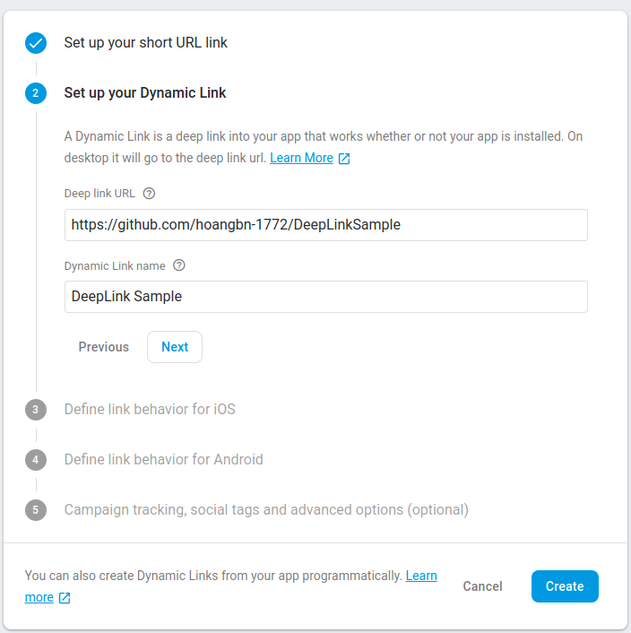

# DeepLinkSample
- Tìm hiểu về Deeplink trong Android.
## Overview

### **Deeplink**
- Là các URL đưa user trực tiếp đến nội dung cụ thể trong ứng dụng. Trong Android bạn có thể thiết lập **Deeplink** bằng cách sử dụng **intent-filter**.
- Nếu trên thiết bị người dùng có nhiều ứng dụng có thể xử lý URL, thì hệ thống sẽ hiển thị một dialog yêu cầu người dùng chọn ứng dụng để xử lý.
- Khi User click vào URL, hệ thống Android sẽ thử từng action sau theo thứ tự, cho đến khi request thành công:
  + Mở ứng dụng ưa thích của người dùng có thể xử lý URI, nếu ứng dụng được chỉ định.
  + Mở ứng dụng có sẵn có thể xử lý URI
  + Cho phép User chọn một ứng dụng từ dialog.

### **Android App link**
- Là một HTTP URL Deeplink, cho phép một ứng dụng chỉ định chính nó làm trình xử lý mặc định cho liên kết. **Nhưng nó chỉ hoạt động từ Android 6.0 (API level 23) trở lên**.
- Nếu người dùng không muốn app trở thành trình xử lý mặc định, họ có thể cài đặt trong device system setting.
- Một số lợi ích:
  + An toàn và cụ thể: Android App Link sử dụng HTTP URLs liên kết đến website domain mà bạn sở hữu, vì thế không có app nào khác có thể sử dụng liên kết của bạn. Bạn phải xác minh quyền sở hữu domain.
  + Tăng trải nghiệm người dùng: sử dụng duy nhất một HTTP URL cho cùng một nội dung trên website và ứng dụng, nếu user không cài đặt ứng dụng thì có thể sử dụng website - thay vì nhận error 404.
  + Hỗ trợ Instant Apps: Có thể sử dụng app mà không cần phải cài đặt.
  + Thu hút user từ Google Search: Người dùng truy cập trực tiếp vào nội dung trong app thông qua URL từ Google trên mobile.

## Tạo Deeplink
- Để tạo Deeplink thông qua các bước sau:
1. Add **intent-filter**:

- action: Chỉ định **ACTION_VIEW** để có thể tích hợp tìm kiếm từ Google Search.
- category:
	+ **BROWSABLE** category, để intent-filter có thể truy cập được từ web browser. Nếu không có, khi click link trên browser sẽ không thể liên kết đến app.
	+ **DEFAULT** category, cho phép ứng dụng phản hồi lại các implicit intent.
- data: Có thể thêm một or nhiều thẻ <data>, mỗi thẻ đại diện cho một định dạng URI.
	+ Thuộc tính **android:scheme** là bắt buộc. Nếu không có, tất cả các thuộc tính khác của URI sẽ bị bỏ qua.
	+ **host**: Là domain URI, chỉ có ý nghĩa khi thuộc tính **scheme** được cấu hình. Để khớp nhiều subdomain, sử dụng (*) để tạo ra 0 hoặc nhiều host. Ví dụ ***.google.com** có thể tạo ra các host như www.google.com, .google.com, developer.google.com
	+ **port**: là cổng của URI. Chỉ có giá trị khi **scheme và host** được cấu hình.
	+ **path, pathPrefix, pathPattern**: Phải bắt đầu bằng **'/'**
		+ path: Là đường dẫn hoàn chỉnh khớp với đường dẫn hoàn chỉnh trong Intent.
		+ pathPrefix: Chỉ định đường dẫn một phần khớp với phần đầu của đường dẫn trong Intent.
		+ pathPattern: Tương tự như path nhưng nó có thể chứa các ký tự đại diện như: (*), (.*)

2. Lấy data từ Intent gửi đến.
- Dữ liệu gửi đến là một URI, có thể lấy được các params cần thiết bằng các method như **getData()**, **getAction()**:

3. Test deep link
- Bạn có thể sử dụng <a href="https://developer.android.com/studio/command-line/adb">Android Debug Bridge</a> cùng với **activity manager (am)** để kiểm tra intent filter URI. Bạn có thể run lệnh trong command với device or emulator.
- Cú pháp chung: **$ adb shell am start -W -a android.intent.action.VIEW -d <URI> <PACKAGE>**
- Ví dụ: **adb shell am start -W -a android.intent.action.VIEW -d "example://gizmos" com.example.deeplinksample**

## Tạo Android App Link
1. Tạo Deeplink: Như trên
2. Xác minh cho Deeplink: Cấu hình ứng dụng để yêu cầu xác minh các app link. Sau đó, publish file **Digital Asset Links JSON** trên website của bạn để xác minh quyền sở hữu thông qua <a href="https://support.google.com/webmasters/answer/9008080">Google Search Console</a>.<a href="https://developer.android.com/training/app-links/verify-site-associations.html">Verify Android App Links</a>

- Ngoài ra, ta có thể sử dụng <a href="https://developer.android.com/studio/write/app-link-indexing.html">Android App Links Assistant</a> là một công cụ trong Android để tạo Android App Links

### Android App Links Assistant.
- Để add Android App Link vào project ta làm theo các bước
1. Create intent filters in your manifest.
- Vào: Tools -> App Links Assistant
- Click Open Mapping Editor, chọn Add và điền thông tin vào form.
- Sau khi bấm OK thì intent-filter sẽ được generate trong manifest.
- Để verify URL có hoạt động đúng, điền URL vào trường **Check URL Mapping** và click **Check Mapping**.

2. Xử lý liên kết gửi đến
- 
3. Liên kết ứng dụng với website cùng với <a href="https://developers.google.com/digital-asset-links/v1/getting-started">Digital Asset Links</a>
- Để tạo <a href="https://developer.android.com/training/app-links/verify-site-associations.html#web-assoc">Digital Asset Links</a>
- Clcik **Open Digital Asset Links File Generator**:

# Deeplink với Navigation Component.
- Tìm hiểu về Navigation Component: <a href="https://developer.android.com/guide/navigation/navigation-getting-started">Navigation Component</a>
- Tạo Deeplink cho Destination <a href="https://developer.android.com/guide/navigation/navigation-deep-link">Create a deep link for a destination</a>

1. Thêm Deeplink vào trong Destination: Có 2 cách
- Explicit deep link (code): Sử dụng pendingIntent chuyển đến một màn hình cụ thể trong app. Deeplink hiển thị như một notification, tiện tích,...

- Implicit deep link (Sử dụng navigation editor): Là một URI chỉ định đến destination trong app.

2. Định nghĩa nav-graph trong manifest

3. Lấy dữ liệu từ Deeplink

# Firebase Dynamic links (Deferred Deep Link)
- Dynamic Link là một **deeplink** trong ứng dụng của bạn cho dù ứng dụng có được cài đặt hay không. Nó hoạt động theo cách bạn muốn, trên nhiều nền tảng.
- **Dynamic Links** mang đến trải nghiệm tuyệt vời nhất tới người dùng. Khi user mở một **Dynamic Links** bằng iOS or Android or Desktop Browser người dùng sẽ chuyển đến nội dung được liên kết trong ứng dụng, nếu ứng dụng chưa được cài đặt, user sẽ được chuyển đến Play Store or App Store để cài đặt app (do ta cấu hình).

- **Dynamic Link** bao gồm các thông tin sau:
	+ Project information: 
	+ package name
	+ fallback Url: Địa chỉ chuyển hướng tới nếu app chưa cài đặt.
	+ Deep link

## Create Dynamic Links on Android
- Để thêm Dynamic Link vào trong app, bạn cần add project lên Firebase
1. Set up Firebase and Dynamic Links SDK: 
- Thêm Firebase vào Android Project <a href="https://firebase.google.com/docs/android/setup">add Firebase to your Android project.</a>
- Trong build.gradle (project-level), đảm bảo bao gồm Google's Maven trong cả buildscript và allprojects
- Add dependency Firebase Dynamic Links Android library.

2. Create Dynamic Links (Sử dụng <a href="https://console.firebase.google.com/project/_/durablelinks/links/">Firebase console</a>)
- Firebase Console → Select your project →  Dynamic links (Left side panel, under Grow) → Get Started: Sau đó điền domain của bạn.

- Click "New Dynamic link", điền các thông tin trong hộp thoại:

- Debugging Dynamic Links (previve page flowchart):

- **Recommended**: Để ngăn chặn các bên trái phép tạo Dynamic Links chuyển hướng từ domain của bạn đến các website mà bạn không kiểm soát, bạn nên liệt kê danh sách các URL mà Dynamic Link của bạn có thể chuyển hướng đến. See <a href="https://support.google.com/firebase/answer/9021429">Whitelist URL patterns.</a>

3. Handle Dynamic Links in your app
- Manifest:

- Get data:

